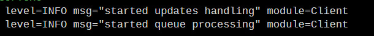

# Track Poster
[//]: # "Badges"


> **Go Telegram Bot** for automating sending tracks to *Telegram channel*. Uses `yt-dlp` for downloading music and `ffmpeg` for  audio conversion.

**Project status: *Work In Progress.***

## How to use
- Download prebuilt binary from [Releases](https://github.com/TechAngle/trackposter/releases) or build it manually (read in [Build](#Build) section).
- Create `.env` file near to `trackposter` binary with such fields:
```bash
# Telegram token (get it from @BotFather)
TOKEN=

# Telegram IDs that can use bot (separate with ', ')
ALLOWED_ID=
```
- Run binary and wait until you'll similar lines:



- Send any URL (that supported by `yt-dlp`) to bot you've created.
- Wait a bit while bot will download your track and upload to Telegram.

## Build
### Prerequisites
- *Cloned repository using:*
```bash
$ git clone https://github.com/TechAngle/trackposter  
$ cd ./trackposter
```
- Installed **Go 1.23+**
- Installed [**go-task**](https://taskfile.dev/)
- Installed **ffmpeg** and **yt-dlp**.

### How to build
```bash
$ task build
```

## Contributing
Check out [CONTRIBUTE](./CONTRIBUTE.md)

## LICENSE
Project is distributed under the [Mozilla Public License 2.0 (MPL)](./LICENSE) License
